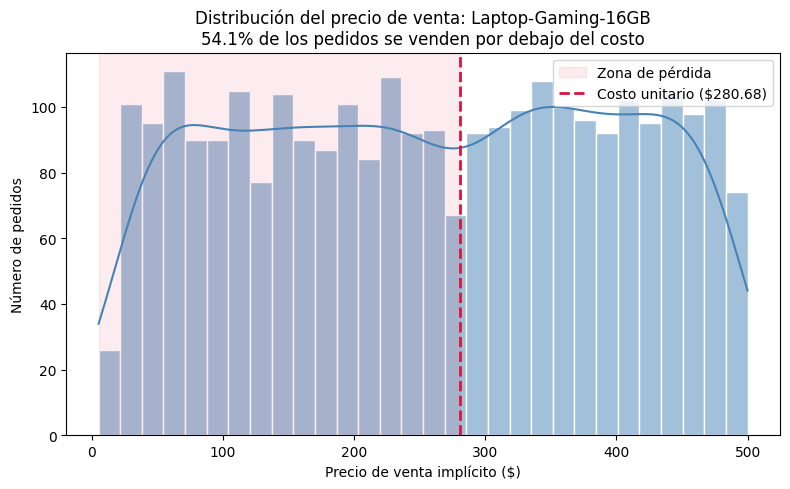
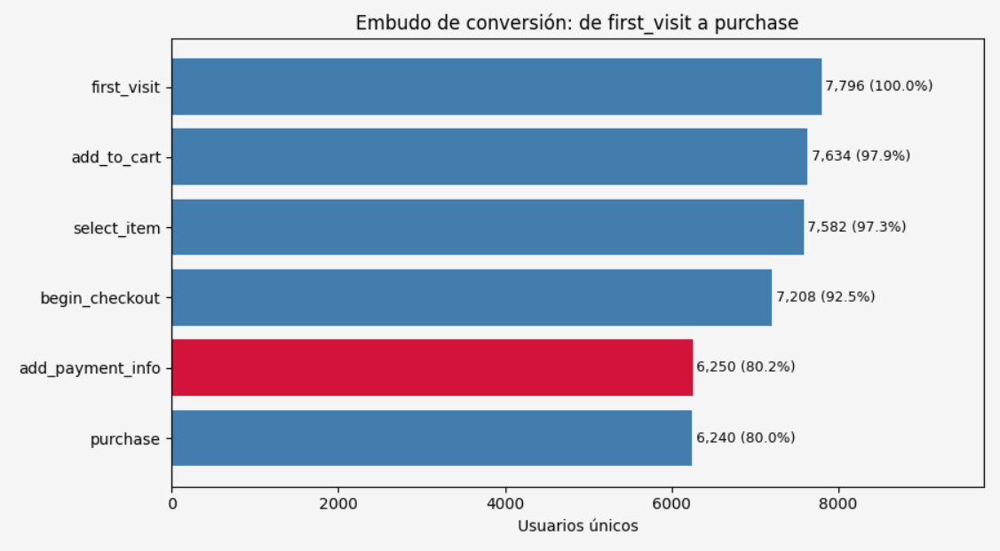

🇪🇸 Español | 🇬🇧 [English](./README.md)

# Proyecto final de Bootcamp Data Analytics TripleTen

## Contexto
RappiPlus es un servicio de suscripción dentro del ecosistema de Rappi diseñado para aumentar la frecuencia de compra y el valor generado por usuario.

Sin embargo, el equipo de negocio no tiene claro si el servicio está cumpliendo su objetivo.

Existen dudas clave:
- ¿Los usuarios realmente compran más? 
- ¿El modelo está generando ganancias?
- ¿Se están perdiendo oportunidades en el proceso de compra?

## Objetivo del proyecto
Responder:
- ¿Son confiables los datos?
- ¿Estamos ganando?
- ¿Dónde se pierden los usuarios?
- ¿Los usuarios regresan?
- ¿Los cambios generan impacto?
- ¿Cómo comunicamos todo esto?

## Resumen ejecutivo de resultados

| Pregunta | Respuesta |
|---|---|
| ¿Son confiables los datos? | Sí, tras limpieza (24,920 pedidos sin nulos, imputación probabilística en `dispositivo`, estandarización de fechas y texto) |
| ¿Estamos ganando? | Sí: margen bruto 60.13% ($5.78M), margen neto 30.26% ($2.91M) tras descontar marketing. Pero 18.19% de los pedidos se venden en pérdida, concentrado en 3 productos sin piso de precio (Laptop-Gaming-16GB con 54% de sus pedidos en pérdida) |
| ¿Dónde se pierden los usuarios? | En el embudo de conversión, la mayor fuga (13.29 pp) ocurre en `begin_checkout → add_payment_info`. Conversión acumulada total: 80.04% |
| ¿Los usuarios regresan? | Retención estable entre 40-44% en las 3 semanas posteriores al registro, sin diferencias relevantes entre cohortes mensuales (ene-may 2025) |
| ¿Los cambios generan impacto? | El rediseño de UI del checkout (test A/B, n=10,000) no mostró efecto significativo en conversión (p=0.416) ni en duración de sesión (p=0.148) |
| ¿Cómo comunicamos todo esto? | Dashboard de 2 páginas en Power BI (Overview Ejecutivo + Detalle con drill-through) |

### Vistazo visual

Detalle completo de metodología y hallazgos en [`conclusion.md`](./conclusion.md).

## diccionarios de datos
El análisis comienza con tres fuentes iniciales:
### Ordenes
Cada fila representa un pedido realizado en la plataforma
| Columna | Tipo de dato | Descripción |
| --- | --- | --- |
| id_pedido | Categórica | ID único del pedido |
| id_usuario | Categórica | Identificador del usuario que realizó el pedido |
| fecha_hora_pedido | Fecha | Fecha en la que se realizó el pedido |
| pais | Categórica | País desde donde se realizó el pedido |
| dispositivo | Categórica | Dispositivo utilizado para realizar el pedido |
| fuente_referencia | Categórica | Canal de adquisición del usuario |
| nombre_producto | Categórica | Nombre del producto comprado |
| categoria_producto | Categórica | Categoría del producto |
| Cantidad | Numérico | Cantidad de productos comprados |
| precio_unitario | Numérico | Precio por unidad del producto |
| monto_descuento | Numérico | Descuento aplicado al pedido |
| monto_total | Numérico | Monto total pagado por el pedido |

### Catálogo
Cada fila representa un producto disponible en la plataforma
| Columna | Tipo de dato | Descripción | Ejemplo |
| --- | --- | --- | --- |
| nombre_producto | Categórica | Nombre del producto | Laptop-Gaming-16GB |
| categoria_producto | Categórica | Categoría a la que pertenece el producto | Electrónica |
| costo_unitario | Numérico | Costo por unidad de producto | 280.68 |
| proveedor | Categórica | Empresa proveedora del producto | Fuller, Pena and Myers |

### Gastos de marketing
Cada fila representa una inversión en marketing realizada en un país y canal específico.
| Columna | Tipo de dato | Descripción | Ejemplo |
| --- | --- | --- | --- |
| fecha | Fecha | Fecha en la que se realizó la inversión | 2025-01-01 |
| pais | Categórica | País donde se ejecutó la campaña | México |
| id_campaña | Categórica | Identificador único de la campaña | organic_Mexico |
| canal | Categórica | Canal de marketing utilizado | organic | 
| gasto | Numérico | Monto invertido en la campaña | 2446.25 | 
